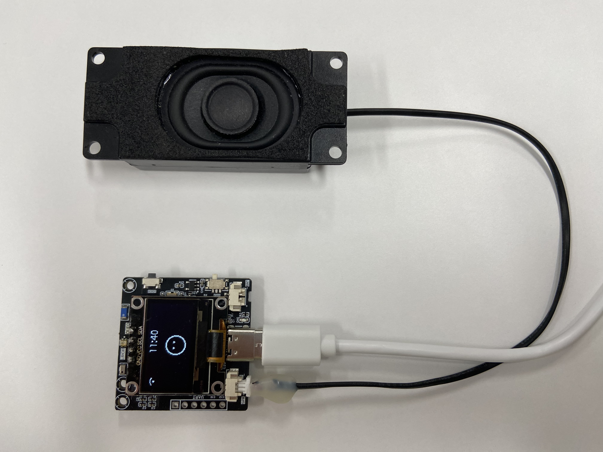

# 小智聊天机器人

## 背景

基于目前ESP32平台的小智聊天机器人比较火，以及个人对这方面比较感兴趣，也一直从事相关音频方向的技术开发，本人淘了一块虾哥Xmini-C3开发板回来试用研究，购买链接如下：

👉 [人小智AI机器人智能语音聊天虾哥Xmini-C3开发板【taobao】](https://item.taobao.com/item.htm?id=883651064619&pisk=glZYOisYY_fcE4ExE-7ksvWfOJXoka24USyBjfcD57F86Jp0oVci5cFU9VtGum0tX7Gumj2mcAg_sWamGrcMXlFzMnxic5jt1JzPQjD0mdH_PSKgo-c0ydn4qrxiisoTCWmOt6jhx-yqYc1htEwKRPiIKIMXsjwWPcDTr-TDd-yqbf9k1w473dF1AosjCf6-VAHe5cgjC49SaAYj15GjPQMKLci_1VgSPADECCgXcY6-3xtX5xgbFUMEKx9b1c6JVvhS1cgb18G2p1hWhfxT-iIGe3vR_hxg2x3x6hcJXkqyxqlI3bt1OxMATXwjwhtsgx2o98ecMHyo0lNKKSjWDWe_LPg8XQ1K_ue7cPwyMTiLez4nkzCXXbqmB2isydt_ecaj7liCAQHzP-4_0Sp9fxr0xVhEyOtZS0ZnRyNvQ9yScANZ8lfe0jw_LkznvidEHzwK2go_xkF7tBcKIE6ReF8ZlYS5RH1uyoJoQYhhHGLw74WreXXReF8ZlYk-ttB97FuPU&skuId=5722150800953&spm=tbpc.boughtlist.suborder_itemtitle.1.25f22e8dTNHeef)

## 介绍

虾哥Xmini-C3开发板是一个由虾哥开源的 ESP32 项目，github地址如下：

👉 [xiaozhi-esp32【github】](https://github.com/78/xiaozhi-esp32#)

## 硬件

开发板硬件效果如下图所示：

## 开发

开发板买回来后，迫不及待地上电开机配网试用了一下效果，聊天对话交流这些都还不错，惟一感觉美中不足的是播放音乐时声音比较沉闷以及音量调到最大时有明显的破音，激起了我改造它的兴趣。

- 1. 首先声音比较沉闷怀疑是不是喇叭效果不行，换了个音腔好一点的喇叭，如下图所示：

更换喇叭后效果确实改善一点点，但还是没有达到理想的效果，下载了github下的开发环境，下一步打算调一下EQ看看；

- 2. 看板子上使用的音频codec是顺芯的ES8311，下载它的datasheet来研究了一番，发现它的EQ调节只支持一段，可调节的效果比较有限，如简单拉高一下低频什么的，还是达不到想要的效果，只能再想想其他办法。
     
     网上搜索了解了一下，无意间看到晶益微公司官网上有个JY6311刚好跟ES8311是PinToPin的，并且主要是它的DAC EQ支持3段调节，能够满足常用的EQ效果调节需求，果断在官网申请了样片并下载了相关的datasheet以及申请驱动支持包等。
     
     参照ES8311提前把驱动移植进了开发环境，并按JY6311的EQ调节工具相关说明调节了一版EQ和DRC参数集成到了驱动里面。芯片到手后立刻焊接起来听了一下效果，果然调节了3段EQ后声音没那么沉闷了，人声比较突出，低音也比较强劲，听起来舒服多了。并且由于使用DRC压了一下，也没有破音了。

## 分享

效果改造好一点后满足感油然而生，想着目前这个小智聊天机器人最近比较火，把改造后的成果分享出来和大家一起共享，也欢迎其他技术爱好者提出其他宝贵建议并持续开发优化。

- **晶益微官网**：可下载datasheet、申请样片和驱动支持包等；

👉 [珠海晶益微电子有限公司](https://www.amplore.com/)

- **JY6311驱动开发环境**： 在虾哥Xmini-C3开发环境(V1.7.6版本)基础上集成了JY6311驱动的开发环境github地址如下：

👉 [xiaozhi-esp32-main_jy6311【github】](https://github.com/Clover-Luckily/xiaozhi-esp32-jy6311#)

- **开发环境使用**：参考虾哥Xmini-C3的开发环境使用即可，github地址上面已经给出；

- **CSDN技术交流**：此项目也在CSDN上写了一遍博客详细介绍，有什么疑问欢迎一起讨论，CSDN博客地址如下：

👉 [基于虾哥Xmini-C3开发环境的JY6311驱动移植及效果优化【CSDN】](https://blog.csdn.net/pjw52013140/article/details/149072552?spm=1001.2014.3001.5502)
